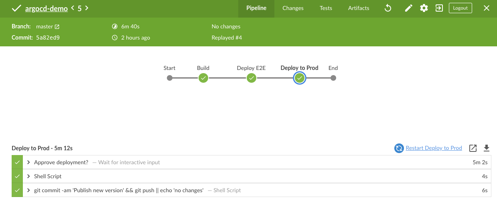

# Argo CD Demo

Repository demonstrates an application deployment using Jenkins and Argo CD.

The application deployment manifests are located in https://github.com/alexmt/argocd-demo-deploy. The
application has `e2e` and `prod` environment. The deployment process is implemented using using GitOps methodology and automated using Jenkins pipeline.

The pipeline is responsible for building the Docker image and updating deployment repository. The deployment changes are pushed to the Kubernetes cluster by [Argo CD](https://cd.apps.argoproj.io)
